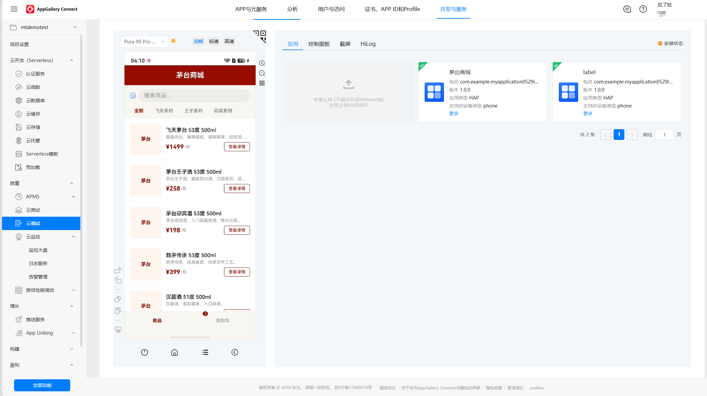
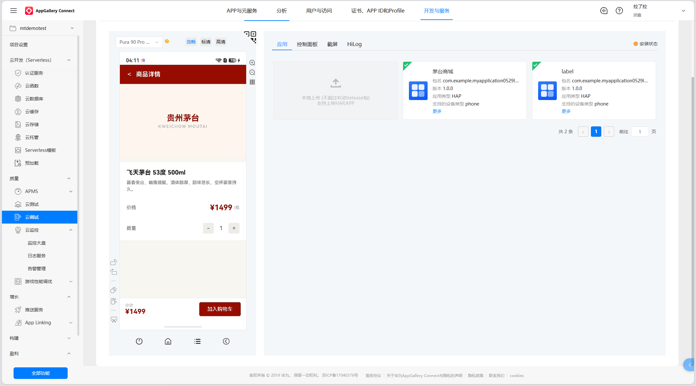
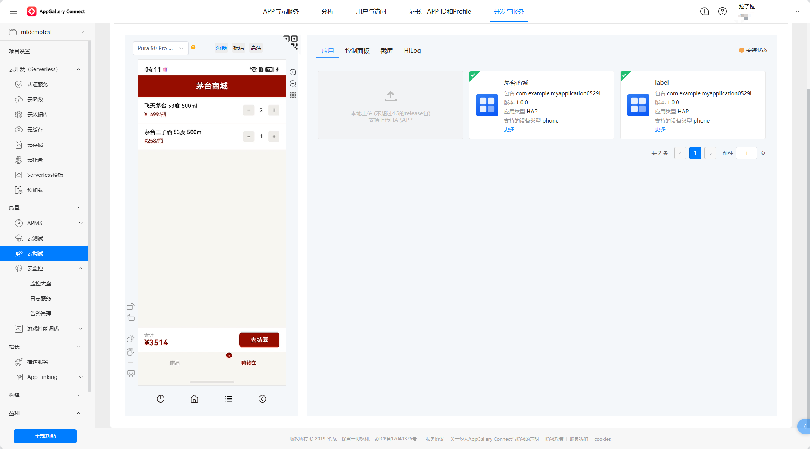
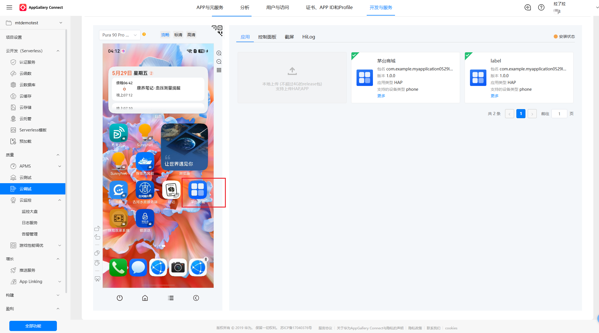

# 购物商城 - HarmonyOS Demo

基于 ArkTS + ArkUI 的茅台商品展示应用，走通了 DevEco Studio 从编码到真机部署的完整流程。

## 功能

- 商品列表展示（搜索、分类标签）
- 商品详情页（数量选择、加入购物车）
- 购物车管理（数量增减、合计计算、结算）
- 底部 Tab 导航

## 技术栈

- 开发语言：ArkTS
- UI 框架：ArkUI 声明式开发
- 应用模型：Stage 模型
- 开发工具：DevEco Studio 5.0
- SDK 版本：6.1.1 (API 24)

## 项目结构

```
entry/src/main/
├── ets/
│   ├── entryability/
│   │   └── EntryAbility.ets       # 入口 Ability
│   ├── model/
│   │   └── Product.ets            # 数据模型（Product、CartItem）
│   └── pages/
│       ├── Index.ets              # 首页（商品列表 + 购物车）
│       └── Detail.ets             # 商品详情页
├── resources/                     # 资源文件
└── module.json5                   # 模块配置
```

## 运行方式

1. 使用 DevEco Studio 打开项目
2. 配置签名证书（见下方步骤）
3. 连接设备（真机/模拟器）或使用远程真机
4. 点击 Run 或 Build → Build Hap(s)/App(s)

### 签名配置步骤

1. 登录 [AppGallery Connect](https://developer.huawei.com/consumer/cn/service/josp/agc/index.html)，创建项目和应用
2. 在「证书、APP ID和Profile」中生成调试证书，下载 `.cer` 和 `.p12` 文件
3. 创建 Profile（类型选调试），下载 `.p7b` 文件
4. 将三个文件放入项目根目录的 `config/` 文件夹
5. 打开 DevEco Studio → File → Project Structure → Signing Configs
6. 手动填写：
   - Store File：`config/你的证书名.p12`
   - Store Password：创建证书时设置的密码
   - Key Alias：证书别名
   - Key Password：同 Store Password
   - Profile：`config/你的profile名.p7b`
   - Certificate：`config/你的证书名.cer`
7. 点 OK，重新构建

## 真机验证

本项目通过华为 AppGallery Connect 的**云调试**功能，在远程真机上完成验证。

- 平台：[AppGallery Connect](https://developer.huawei.com/consumer/cn/service/josp/agc/index.html)
- 测试设备：Pura 90 Pro（远程真机）
- 验证方式：上传 Release HAP 包 → 云调试 → 单机调试

## 界面预览

| 商品列表 | 商品详情 |
|---------|---------|
|  |  |

| 购物车 | 应用安装 |
|--------|---------|
|  |  |

## 遇到的问题及解决方案

### 1. 签名循环问题

DevEco Studio 自动签名需要连接设备，但没有设备就无法生成 Profile 文件。

**解决：** 在 AppGallery Connect 平台手动创建项目 → 生成调试证书 → 下载 .p7b Profile → 手动配置到 `build-profile.json5`。

### 2. SDK 版本兼容

远程真机只支持 API 22，项目默认 `targetSdkVersion` 为 24。

**解决：** 降低 `compatibleSdkVersion` 到 `6.0.2(22)`，`targetSdkVersion` 保持 24，兼容性无影响。

### 3. ArkTS 状态管理 bug

购物车总价显示 `¥undefined`。

**原因：** 使用 `get` 计算 `totalPrice`，ArkTS 对 getter 的响应式触发不够可靠。

**解决：** 改为 `@State` 变量 + `updateCartInfo()` 方法，每次操作购物车后手动更新状态。
